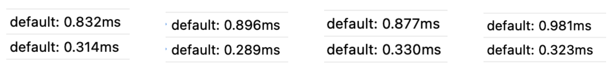

### JSON.stringify 구현하기 ( 평가 전 내 코드 )

---

완벽한 JSON.stringify를 구현하기엔 아직 실력이 부족하기 때문에 가장 쉬운 기초 버전부터 구현해보자.

```jsx
const arr = [1, 'ab"c', true, undefined, null, _ => 3, Symbol(), {}]

console.log(구현할함수(arr) === JSON.stringify(arr))
```

true가 나오도록 함수를 만들어보자.

### 유의할 점

1. undefined, null, 람다, Symbol은 모두 null로 처리된다.
2. 문자열은 escape를 지원해야한다.
   1. 따옴표 내부에 따옴표 존재 시 stringify이후 escape문자로 표현해야한다.   
      ex) 'ab"c' ⇒ "ab\"c"
3. null은 타입을 체크할때 object로 출력되는 오류를 가지고 있다. 따라서 실제 object와 구분하기 위한 장치가 필요하다.
4. 오브젝트의 중첩은 없는것으로 가정한다.
   기초단계이기 때문에 객체 리터럴을 변환하려할때 입력값으로 들어오는 리터럴은 오로지 {} 만으로 한다.   
   ex) {parent: { name : 'kim' ,age : 7, family: ['딸','아들']}} 이런식의 중첩된 리터럴은 심화버전에서만 다룬다.
5. js가 strict mode가 아니면 꼬리물기 최적화는 지원되지 않는다. 사파리에서 실험하기 위해서는 반드시 strict mode를 적용시키자.

<br/>

#### validator

```jsx
const validator = {
  data: [
    v => typeof v === 'string',
    v => typeof v === 'number',
    v => typeof v === 'boolean',
    v => typeof v === 'object',
  ],
  data2: [v => typeof v === 'string'],
  data3: [v => !v.length, v => typeof v === 'object'],
  data4: [v => v === null],
  data5: [v => typeof v === 'boolean'],
  data6: [v => typeof v === 'number'],
  valiData(el) {
    return this.data.some(vali => vali(el))
  },
  valistr(el) {
    return this.data2.some(vali => vali(el))
  },
  valiObj(el) {
    return this.data3.every(vali => vali(el))
  },
  valiNull(el) {
    return this.data4.some(vali => vali(el))
  },
  valiBool(el) {
    return this.data5.some(vali => vali(el))
  },
  valiNum(el) {
    return this.data6.some(vali => vali(el))
  },
}
```

#### 재귀

```jsx
if (1) {
  const arr = [1, 'ab"c', true, undefined, null, _ => 3, Symbol(), {}]
  const _stringify = arr => {
    if (arr.length) {
      let shifted = arr.splice(0, 1)[0]
      if (validator.valiNull(shifted) || !validator.valiData(shifted))
        return null + `,${_stringify(arr)}`
      if (validator.valistr(shifted))
        return (
          `"${shifted.replaceAll('"', String.raw`\"`)}"` + `,${_stringify(arr)}`
        )
      else if (validator.valiObj(shifted)) return `{}` + `,${_stringify(arr)}`
      else return `${shifted}` + `,${_stringify(arr)}`
    } else return ''
  }
  const stringify = value => {
    if (!validator.valiData(value)) return undefined
    if (validator.valiNull(value)) return null
    if (validator.valistr(value)) return `"${value}"`
    if (
      validator.valiObj(value) ||
      validator.valiBool(value) ||
      validator.valiNum(value)
    )
      return value
    return '[' + _stringify(value).slice(0, -1) + ']'
  }
  console.log(stringify(test))
}
```

#### tail recursion

```jsx
if (1) {
  const arr = [1, 'ab"c', true, undefined, null, _ => 3, Symbol(), {}]
  const go = (arr, str) => {
    let shifted = arr.splice(0, 1)[0]
    if (validator.valiNull(shifted) || !validator.valiData(shifted))
      return _stringify(arr, (str += 'null,'))
    if (validator.valistr(shifted))
      return _stringify(
        arr,
        (str += `"${shifted.replaceAll('"', String.raw`\"`)}",`),
      )
    if (validator.valiObj(shifted)) return _stringify(arr, (str += '{},'))
    return _stringify(arr, (str += `${shifted},`))
  }
  const _stringify = (arr, str) => {
    return arr.length ? go(arr, str) : str.slice(0, -1)
  }
  const stringify = value => {
    if (!validator.valiData(value)) return undefined
    if (validator.valiNull(value)) return null
    if (validator.valistr(value)) return `"${value}"`
    if (
      validator.valiObj(value) ||
      validator.valiBool(value) ||
      validator.valiNum(value)
    )
      return value
    return _stringify(value, '[') + ']'
  }
  console.time()
  stringify(arr)
  console.timeEnd()
}
```

#### 제어문

```jsx
if (1) {
  const arr = [1, 'ab"c', true, undefined, null, _ => 3, Symbol(), {}]
  const stringify = value => {
    if (!validator.valiData(value)) return undefined
    if (validator.valiNull(value)) return null
    if (validator.valistr(value)) return `"${value}"`
    if (
      validator.valiObj(value) ||
      validator.valiBool(value) ||
      validator.valiNum(value)
    )
      return value

    let str = '['
    for (let i = value.length; i > 0; i--) {
      let shifted = value.splice(0, 1)[0]
      if (validator.valiNull(shifted) || !validator.valiData(shifted)) {
        str += 'null,'
      } else if (validator.valistr(shifted)) {
        str += `"${shifted.replaceAll('"', String.raw`\"`)}",`
      } else if (validator.valiObj(shifted)) {
        str += '{},'
      } else str += `${shifted},`
    }
    str = str.slice(0, -1)
    return str + ']'
  }
  console.time()
  stringify(arr)
  console.timeEnd()
}
```

### 시간 비교 (tail recursion vs 제어문)

### 

<br/>

제어문이 tail recursion 보다 평균적으로 빠른것을 볼 수 있다.

tail recursion까지 구현하는건 괜찮았는데 제어문으로 기계적으로 바꾸는게 어려웠다. 그리고 validator가 너무 난잡해보여서 수정이 필요해보인다.
