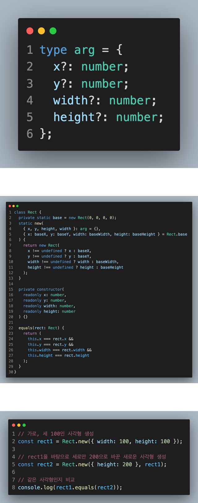

## 그래픽 시스템

> x, y, width, height를 적절히 계산해주는 계산기

---

## 목적

- 일괄된 방법으로 그래픽 사용가능
- 레이아웃을 커스터마이징해서 사용가능
- 주어진 그래픽 시스템이 느린경우 대체제

## 그림이 그려지는 단계

1. Geometry (reflow) : x, y ,width, height 를 확정짓는 단계
2. Fragment (repaint) : 화면상에 점을 찍어 영역을 칠하는 단계

## Container & item

- 부모와 자식 관계

- 절대적인 개념이 아닌 상대적인 개념

  container는 item이 될 수 있고, item도 container가 될 수 있다.

- 최상위 container 존재 ( item이 될 수 없는)

  HTML의 documentElement 같은 것.

## Ts를 이용해 사각형 그리기

### 

- rect1 : 가로와 세로가 100인 사각형
- rect2 : rect1의 상태에서 세로만 200으로 바뀐 사각형
- equals를 이용해 rect1과 rect2가 같은지 비교

## 참고

[bsidesoft](https://www.bsidesoft.com/8071)
