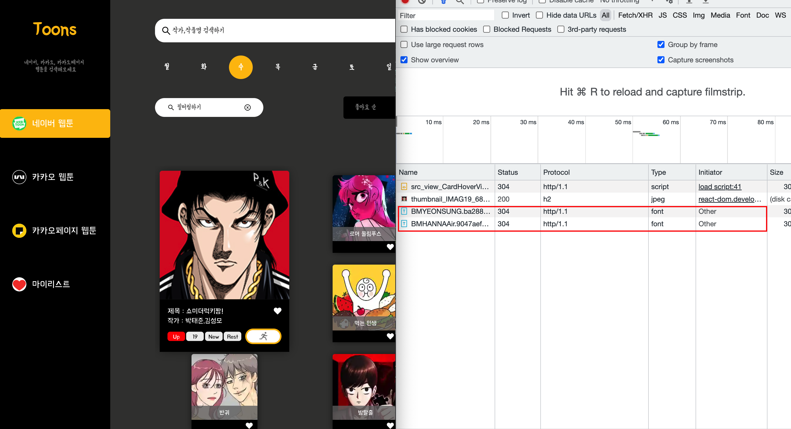
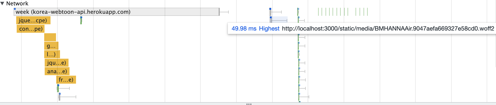
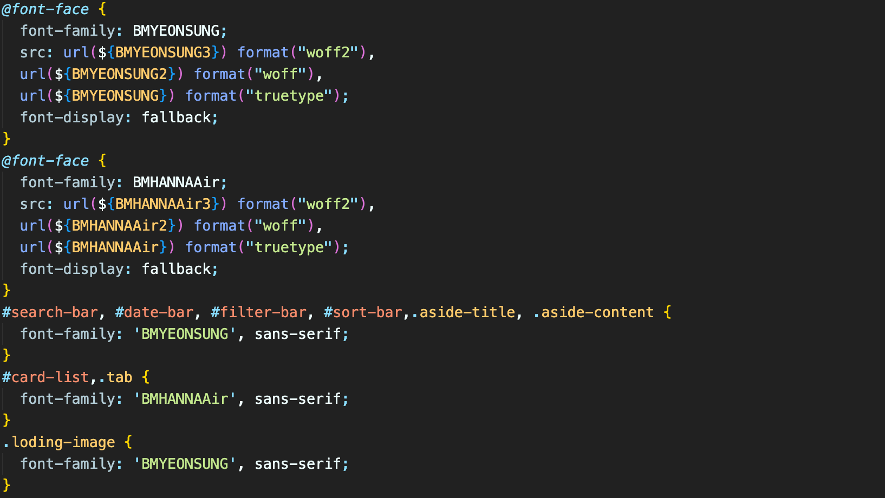
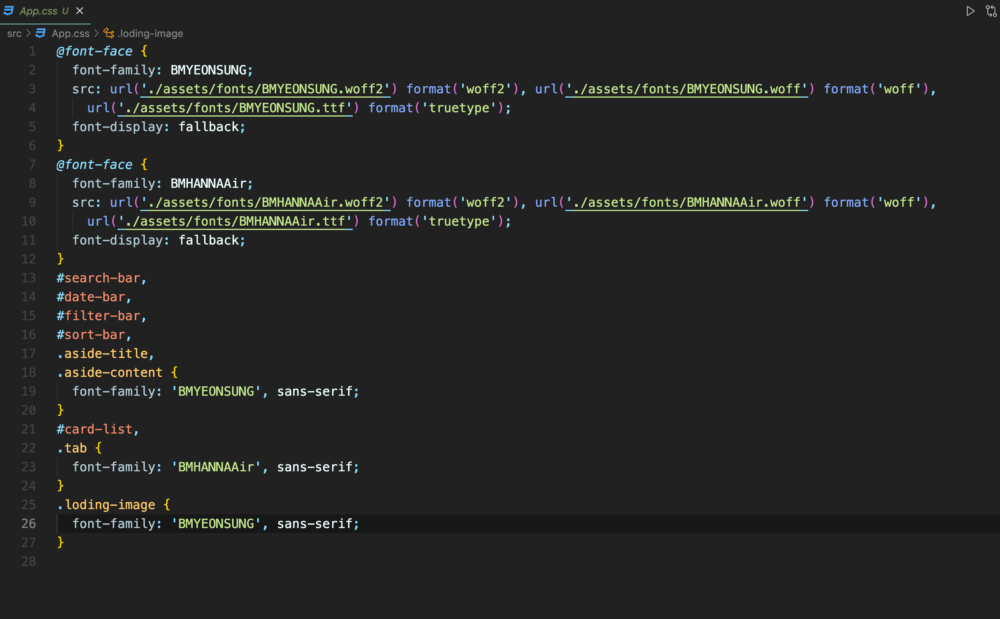

# 문제
---

화면의 사이즈를 줄이거나 늘릴 때 화면의 깜빡임 현상이 발생하는 것을 볼 수 있다. 

 

호버가 되거나 하트 버튼을 클릭하면 마찬가지로 같은 문제가 발생한다. 

 

# 원인
---

원인을 찾지 못해 네트워크를 확인해 보았다.

확인 결과 hover 시 혹은 앞서 언급한 행위를 할 경우 폰트가 재요청되는 것을 확인할 수 있었다.
폰트는 preloading으로 css가 마운트 되기 전에 적용되도록 웹 팩으로 설정을 해놨는데 뭔가 이상했다.

# 
성능 분석으로 통해 폰트가 먼저 preload 되는 것을 확인할 수 있었고

# 
중간에 폰트가 다시 요청되는 것도 확인할 수 있었다. 원인은 폰트에 관련된 문제라고 생각해서 먼저 검색을 해보았다.

`검색 키워드 : React font rerender`

관련 주제를 많이 찾을 수 있었지만 styled-components에 폰트를 적용했을 때 filcker 현상이 일어난다는 것을 알게 됐다.

 

`검색 키워드 : styled components font flickering`

관련 주제로 검색을 해보니 굉장히 많은 이슈를 발견할 수 있었고 모두 다 나와 비슷한 문제를 겪고 있었고, createGlobalStyle에 폰트를 적용한 것이 문제의 원인임을 발견할 수 있었다.

createGlobalStyle은 스타일이 변경될 때마다 head 태그 안의 style 태그를 변경하기 때문에 새로운 style이 적용될 때마다 폰트를 재요청해서 깜빡임 현상이 발생된다고 한다.

따라서 createGlobalStyle에 관한 문제를 해결할 수 있는 두 가지 방법을 찾았다.

# 해결
---

먼저 styled-components 공식 홈페이지에 보면 **font-display를 fallback**으로 주면 해결할 수 있다고 돼있다. 하지만 나의 경우 기존부터 font-display를 
fallback으로 주고 있던 상태라 적절한 방법이 아니였다. 

 

다음으로 font에 관련된 이슈에서 발견한 글을 보면

`I’d really recommend you to avoid createGlobalStyles if it’s static CSS and contains fonts and go for a single global CSS file that resets some CSS and includes your fonts 🙂`
라고 돼있다.
createGlobalStyles에는 동적으로 변하는 font를 설정하지 말고 따로 css 파일로 적용하라는 의미였다. 해당 방법을 적용해 보았다.

globalStyle.ts

기존엔 createGlobalStyles에 적용했던 font 설정을

App.css

App.css 파일로 바꿔주었고,

 
확인 결과

이제 flicker 현상이 발생하지 않는 것을 확인할 수 있다.

# 정리
---

원인 : 새로운 style이 적용될 때마다 폰트를 재요청하게 되는데, createGlobalStyle에 font 설정을 해놓았기 때문이다.

해결 : createGlobalStyle에 font 설정을 하지 말고 따로 css 파일로 적용시켜준다.

# 참고 
---

### 블로그

[font issue](https://github.com/styled-components/styled-components/issues/2900)

[styled-components 공식 홈페이지](https://styled-components.com/docs/faqs#how-do-i-fix-flickering-text-after-server-side-rendering)

[RyuK 성장 일지 - React Styled-Components Font Reloading](https://ryublock.tistory.com/37)

