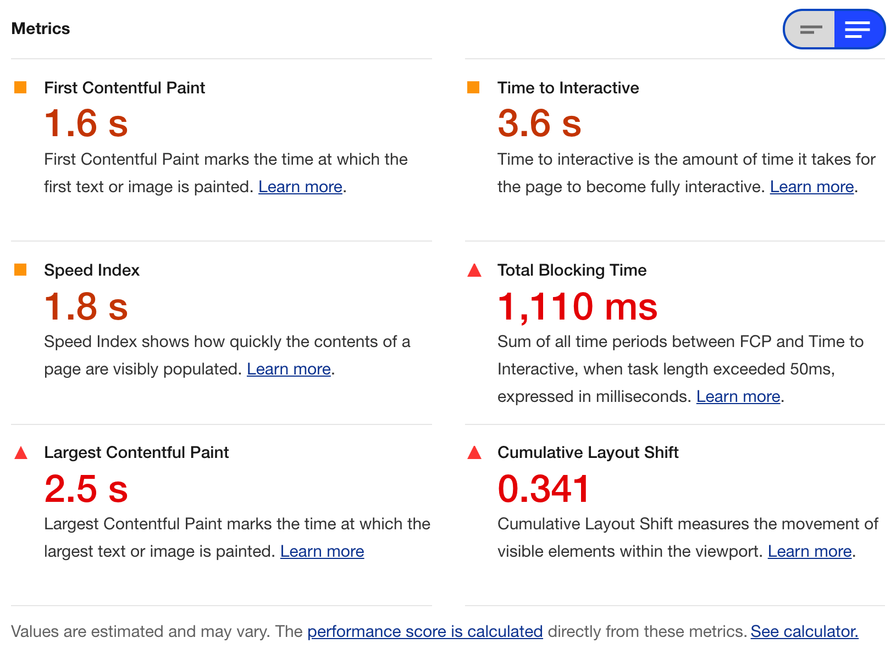
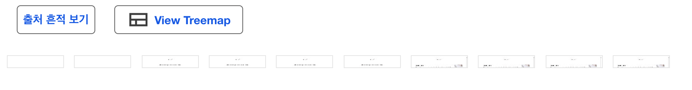
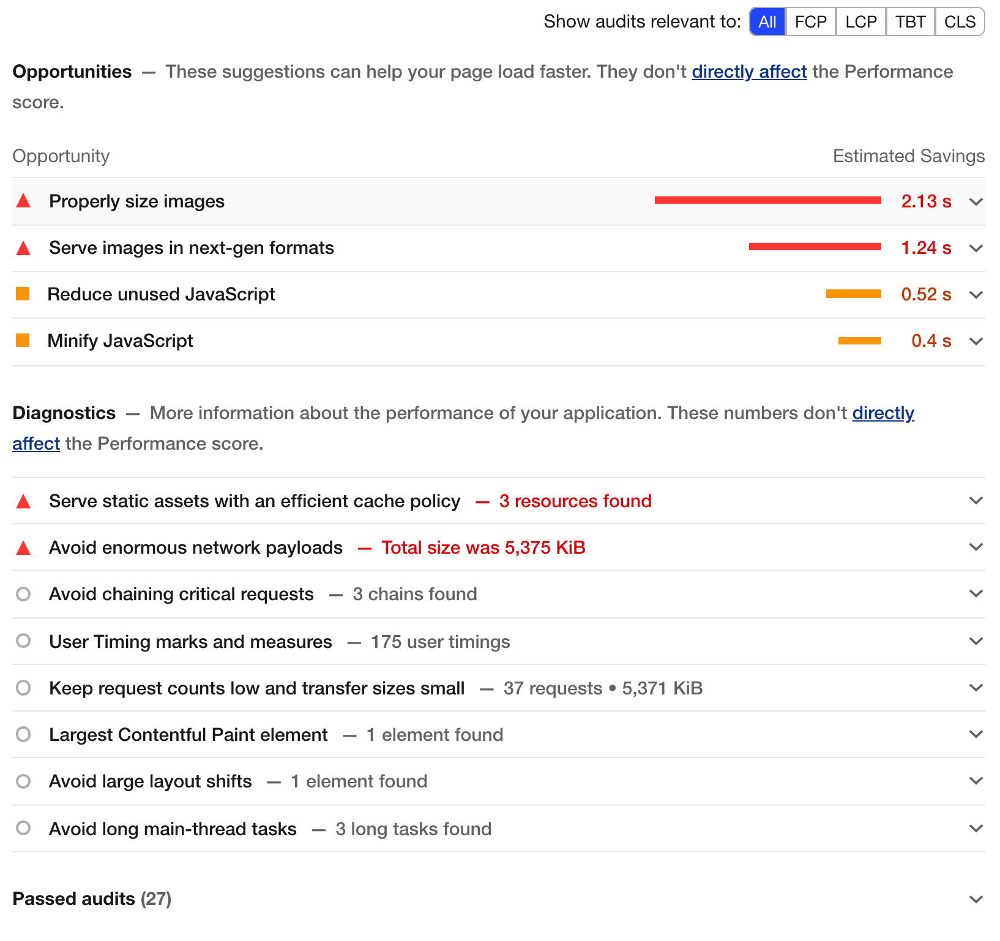
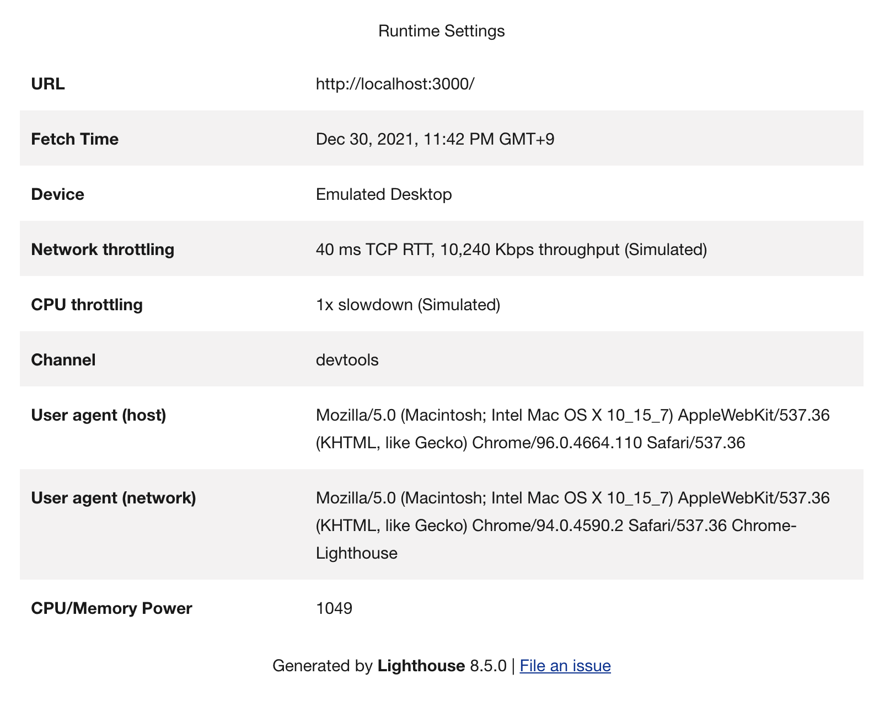

# LightHouse 툴 소개

### 

#### FCP :

첫번째로 이미지 혹은 텍스트가 그려진 시간.

#### TTI :

페이지가 사용자와 상호작용 할 수 있을 때까지 걸리는 시간.

#### Speed Index :

페이지의 내용이 얼마나 빨리 채워지는 보여주는 시간.

#### LCP :

뷰포트에서 가장 큰 콘텐츠 요소가 화면에 렌더링 될때 까지 걸리는 시간으로, 사용자가 페이지의 기본 내용을 볼 수 있는 대략적인 시간이다.

#### CLS :

누적 레이아웃 이동으로 사용자가 예상치 못한 레이아웃 이동을 경험하는 빈도를 측정한 값.

#### TBT :

TTI와 FCP 사이에 발생하는 차단 시간을 말한다. 메인스레드에서 50ms이상 실행되는 작업이 있을때 50ms를 초과하는 시간은 차단된것으로 간주하며 이를 총 합한 시간을 말한다. TBT는 낮을 수록 **( 보통 300ms 이하이면 good )** 좋으며 큰 TBT값은 사용자 경험이 얼마나 열악한지를 나타낼 수 있다.

### 

컨텐츠가 로드되는 흐름을 나타내는 사진이다.

*문제점과 해결방법에 대한 가이드를 제시하는 부분이다.
  붉은색 세모 : Bad   주황색 네모 : soso   회색 동그라미 : 참고*

 

#### Opportunities : 로딩 최적화에 해당하는 경우를 말한다.

1. 이미지 사이즈 최적화
2. 코드 스플리트
3. 파일 압축

#### Diagnostics : 렌더링 최적화에 해당하는 경우를 말한다.

1. 코드의 병목지점에 대한 문제점을 제시한다.

#### Passed audits : 통과한 부분에 대해 말한다.

 

*lightHouse로 검사할때 사용된 환경을 요약하는 표.*

 

## 참고
---

[프론트엔드 개발자를 위한, 실전 웹 성능 최적화(feat. React) - Part. 1](https://www.inflearn.com/course/%EC%9B%B9-%EC%84%B1%EB%8A%A5-%EC%B5%9C%EC%A0%81%ED%99%94-%EB%A6%AC%EC%95%A1%ED%8A%B8-1/dashboard)

[웹 사이트 성능 최적화](https://front-end.me/web/web-site-optimization/)

[Total Blocking Time(총 차단 시간, TBT)](https://web.dev/i18n/ko/tbt/)
