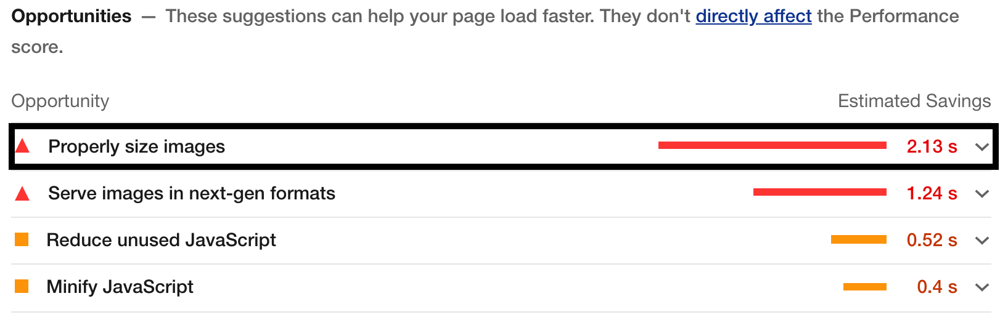
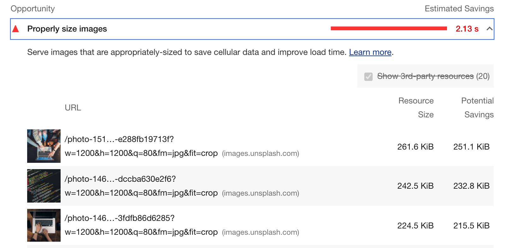
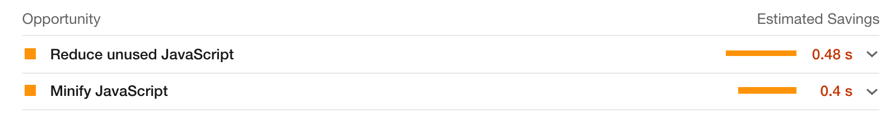

# 이미지를 최적화 하는 방법

이전 Lighthouse에서 분석한 로딩 최적화 문제 중 이미지 사이즈에 관한 부분이 있었다. 

### 

해당 부분을 클릭하면 최적화가 필요한 이미지와 최적화 했을 때 용량을 제시해준다. 

### 

*최적화가 필요한 이미지와 정보를 나열해준다.*

#### Resource Size :
현재 이미지의 용량을 나타낸다. 

#### Potential Savings :
최적화 할 경우 절약할 수 있는 이미지의 용량을 말한다. 

보통 렌더링 하고자하는 **사이즈의 2배만큼의 크기를** 가진 이미지를 불러오고 사용하는것이 가장 좋다.

### 이미지는 로딩되는 상황에 따라 최적화 방법이 다르다.
---

1. 자체 서버에 저장된 static 이미지를 사용하는 경우
    
    이미지를 스스로 조절할 수 있기 때문에 적절한 크기로 직접 잘라서 이용할 수 있다. 
    
2. **API를 이용해서 이미지를 동적으로 불러오는 경우** 
내가 가지고 있는 이미지가 아니기 때문에 직접 자를 수 없다. 

**2번의 경우** 이미지를 최적화 하는 방법에 대해 알아보자. 

### 이미지 CDN을 사용한다.

---

CDN 서버에서 이미지를 사용자에게 보내기 전에 사용자가 원하는 **특정 형태로 이미지를 가공**해서 보내준다. 

- 이미지의 사이즈를 줄이거나
- 이미지의 포멧을 바꾸는 등의 처리가 가능하다.

이미지 CDN은
> 
https://cdn.image.com?src=[img src]&width=[want]&height=[want]

형태로 제공되는데, src=[img src] 에는 원본 이미지의 src를 적고 want엔 원하는 이미지의 사이즈를 적으면 사용자에게 가공된 이미지를  넘겨준다. 

[imgix - The End-to-End Image Solution](https://imgix.com/)

혹은 위와같은 이미지 솔루션을 이용하거나 직접 구축해서 사용할 수 있다. 

### 
어떤 방식으로든 이미지의 크기를 최적화하면
다음과 같이 Property size images 항목이 사라진 것을 볼 수 있다. 

### 이미지 CDN로 사이즈를 최적화 하는것은

---

서버에서 이미지를 최적화하는 시간이 더 늘어나는 것을 의미한다. 

클라이언트에서는 적은 용량의 이미지를 로드 할 수 있겠지만, 그만큼 서버에서 처리되는 시간은 길어지는 것을 생각해야한다. 

따라서 이미지를 업로드할 땐, 한 번 가공된 이미지는 캐시로 저장해두고 재 요청시 불러오는 것이 좋은 방법이다.

## 참고
---

[프론트엔드 개발자를 위한, 실전 웹 성능 최적화(feat. React) - Part. 1](https://www.inflearn.com/course/%EC%9B%B9-%EC%84%B1%EB%8A%A5-%EC%B5%9C%EC%A0%81%ED%99%94-%EB%A6%AC%EC%95%A1%ED%8A%B8-1/dashboard)
