# useState 만들어보기 

setState를 이용해 값을 바꾸면 새롭게 렌더링 되는데 어떻게 초기값이 아닌 바뀐 값으로 유지될 수 있을까?

useState를 Javascript로 만들어보며 알아보았다. 

버튼을 누르면 lists에 1씩 증가된 값이 추가되는 형태를 만들어보자. 

#### HTML

#### 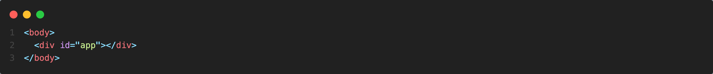

#### JS

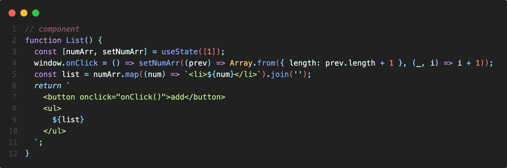

List 컴포넌트는 위와 같이 만들었다. 

1. useState로부터 numArr와 setNumArr를 받는다. 
2. 버튼을 클릭하면 setNumArr에 콜백 함수를 넘겨준다. 
3. numArr로부터 li 태그를 만들고 
4. string을 리턴한다. 

이제 useState를 만들어보면

 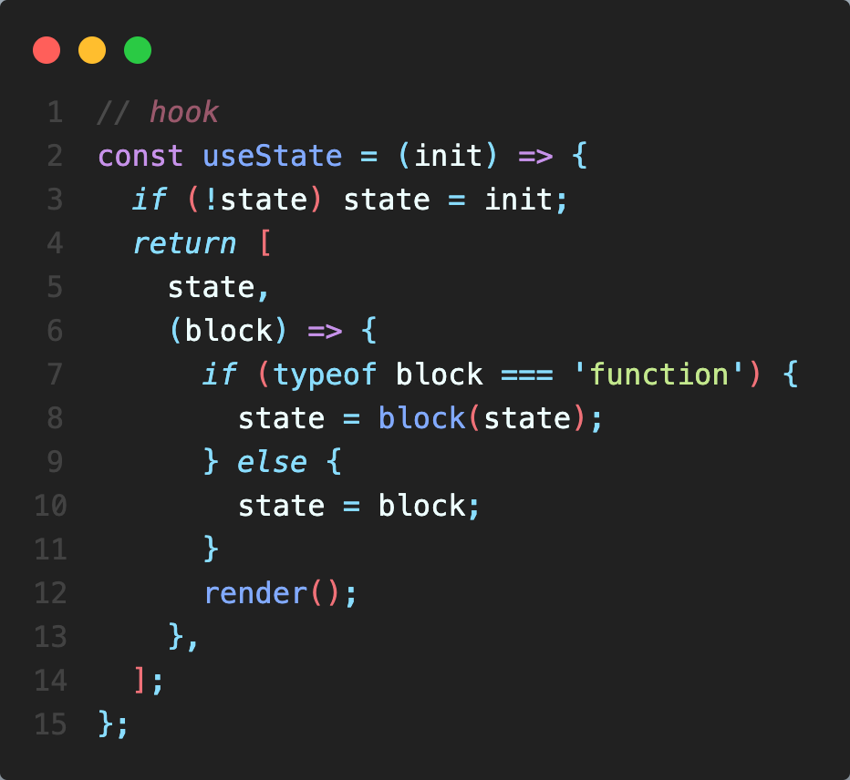

1. useState는 초기값을 받는다. 
2. 그리고 상태를 저장하기 위해 외부에 저장된 state를 이용하고, state가 없으면 초기값으로 설정한다. 
3. state와 setNumArr를 위한 콜백 함수를 return 해주는데, 만약 인자로 들어오는 값이 함수라면 prev를 위해 state를 인자로 넣어 실행시키고, state를 업데이트해준다.
4. block이 함수가 아니라면 바로 state에 할당한다. 
5. 업데이트된 값을 컴포넌트에 적용하기 위해 재렌더링을 시켜준다. 

이제 render를 만들어보자. 

render가 발생하면 app을 초기화 시키고, 가장 최신의 List 리턴값을 반영해야 하므로 다음과 같이 작성했다. 

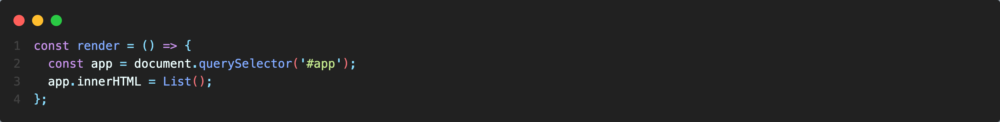

1. 렌더가 발생된다면 초기값이 아닌 최신 값의 state를 반영하기 위해 외부에 state를 선언했다.

2. render가 호출되면 app을 가져온 뒤, List 함수를 넣어준다. 

   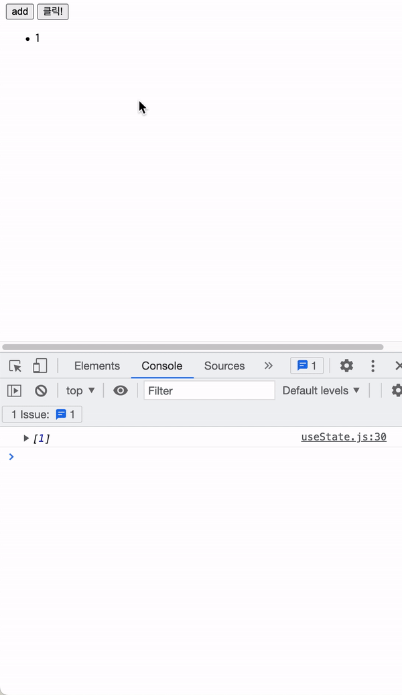

다른 상태까지 추가된다면 어떨까?

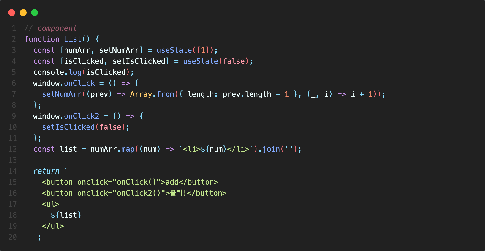

1. isClicked라는 상태를 추가했다. 
2. 클릭! 버튼을 누르면 isClicked의 상태가 true, false로 번갈아 바뀌어야 한다.

확인해 보면 그렇지 않다는 것을 알 수 있다. 

   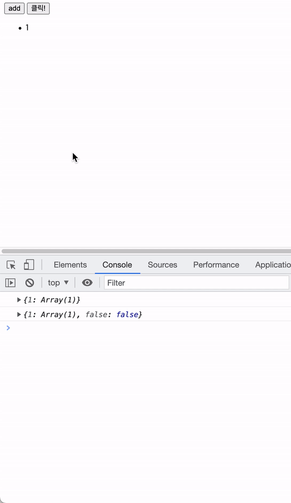

바로 외부에 저장한 state로 numArr, isClicked 모두를 관리하려고 해서 그렇기 때문이다. 

따라서 여러 개의 컴포넌트 혹은 여러 개의 상태에 대응하기 위해서는 외부에 state를 저장할 저장 공간이 필요하다는 것을 알 수 있다. 

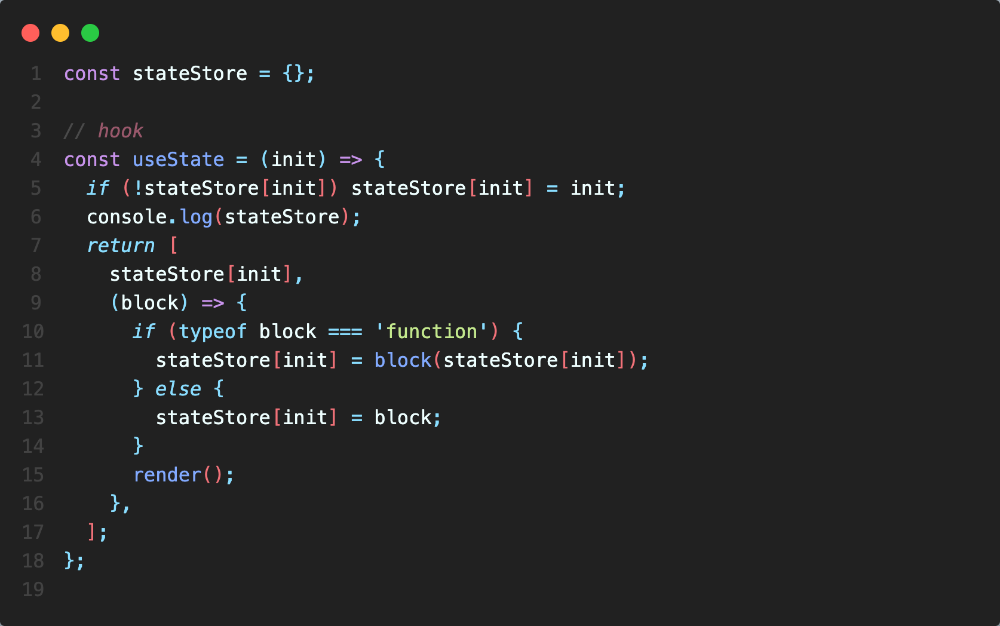

stateStore라는 객체 저장 공간을 생성한 뒤, key 값으로는 init을 주었다. 이렇게 하면 useState를 사용할 때마다 key 값으로 저장 공간에 값이 저장되기 때문에 독립적으로 이용할 수 있게 된다. 

하지만 한 가지 문제가 있다. 바로 key 값이 고유하지 않다는 것인데, 현재는 key를 useState의 초기값인 init으로 주었기 때문에 다른 곳에서 같은 init으로 useState를 생성하게 되면 겹치는 문제가 생긴다. 

이를 해결하기 위해 초기값이 아닌 고유한 값으로 key를 설정할 필요가 있다.

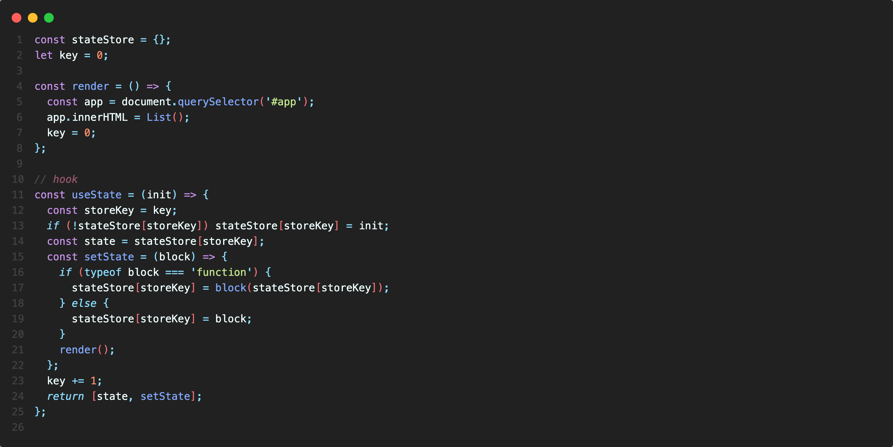

이를 위해 외부에서 key를 관리하기로 했다. 흐름을 살펴보면

useState가 실행될 때마다 stateStore의 key에 정보가 저장되고, key를 1씩 증가한다. 이렇게 하면 현재 

1. stateStore[0] = block(stateStore[0])으로,

2. stateStore[1] = block으로 저장이 된다. 

그리고 setState가 실행되면 재렌더링이 발생하는데, 이때 key 값을 0으로 초기화해야 stateStore에 저장해놓았던 데이터에 접근할 수 있다. 만약 초기화하지 않으면 key 값은 계속 증가하기 때문에 기존 정보에 접근할 수 없게 된다. 

그리고 가장 중요한 부분이 

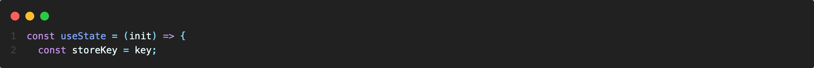

위 부분인데, key 값을 현재 스코프에 고정시키는 역할을 한다. 만약 storeKey로 key를 고정시키지 않는다면 render할 때마다 key를 0으로 초기화 하기 때문에 클릭이 일어나면 항상 stateStore[0]에 접근하게 된다. 예를 들어

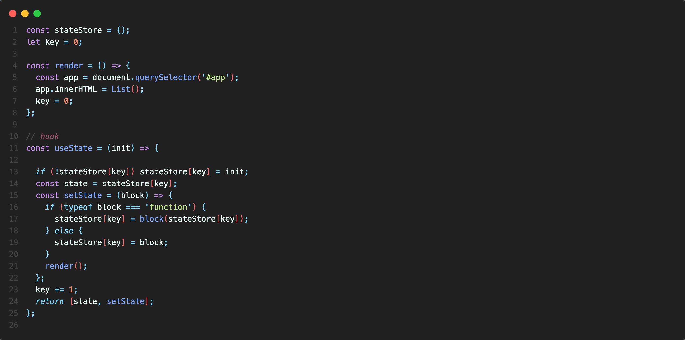

이렇게 하면 key는 항상 0이 되기 때문에 setState 부분 에서 Key를 참조할 때 항상 0을 가져오게 된다. 따라서 위와 같이 작성하면 정상적으로 값을 출력할 수 없다. 

이렇게 외부에서 저장된 어떤 값을 

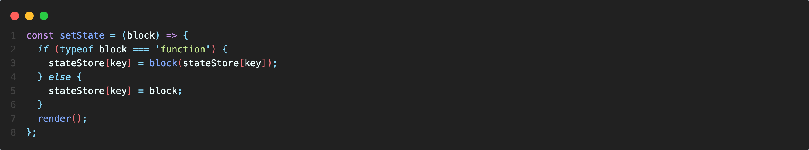

중첩된 내부 함수에서 사용할 때 내부 함수를 클로저라고 하고, 클로저에 묶인 외부 변수를 자유 변수 라고 한다. 

좀 더 간단한 예제로 보면 다음과 같이 표현할 수 있다. 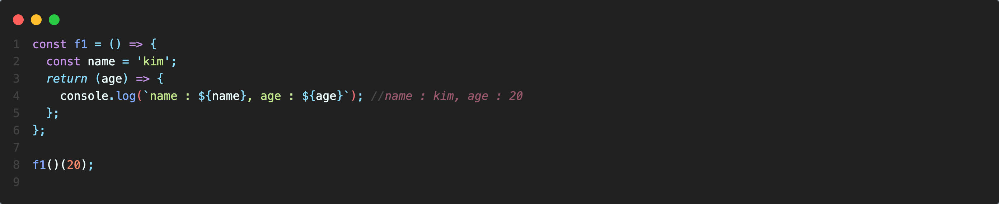

f1의 생명주기가 끝났음에도 불구하고 그 안에서 선언된 name 함수는 중첩 함수에서 여전히 이용되고 있는 것을 확인할 수 있다. 

   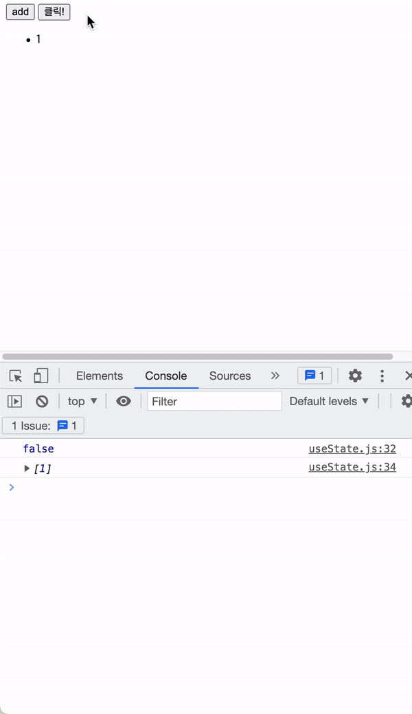

이제 Array와 boolean 값이 개별적으로 잘 출력되는 것을 확인할 수 있다. 

