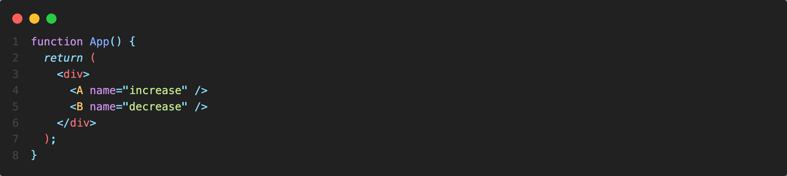
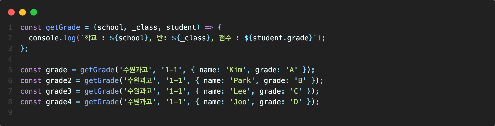

# HOC
---
리액트를 사용하다 보면 중복된 로직을 갖는 컴포넌트가 종종 나온다. 예를 들면 이런 식인데  

A.js 컴포넌트
 

B.js 컴포넌트
 
 

A 컴포넌트와 B 컴포넌트는 onClick의 핸들러 함수 이외에 다른 차이점이 없다.

아주 약간의 다른 점 때문에 전체 코드를 다시 작성해야 하는 불편함을 어떤 식으로 해소할 수 있을지 찾아보았다.

그러던 중 **HOC (higher order component)** 라는 개념에 대해 알게 됐다. HOC란 컴포넌트를 인자로 받아 새로운 컴포넌트로 반환하는 컴포넌트임을 의미한다. HOC를 사용해서 위 중복 로직을 제거하고 컴포넌트를 재사용해 보자. 

먼저 컴포넌트를 인자로 받기 위한 HOC 컴포넌트를 새로 생성한다. HOC 컴포넌트는 기존 컴포넌트와의 차이를 위해 이름에 with을 붙인다고 한다.

 

withCounter.js 컴포넌트
 
  

 withCounter 컴포넌트 내부에 WrapperComponent를 반환하는 함수를 선언한다.
 그리고 해당 함수에서 중복 로직을 정의해 주었다. 이제 A와 B 컴포넌트를 보면

 A.js 컴포넌트
 

 B.js 컴포넌트
 
 

A와 B는 이제 필요한 함수를 props로 전달받아서 이용할 수 있게 됐다. 

조금 더 나아가서 컴포넌트 이름을 App 단에서 정의하고 싶을 경우도 생각해 볼 수 있다. 

App.js

이런 식으로 정의하게 되면 다음과 같은 흐름으로 name이 각 컴포넌트에 전달된다. 

# 

화면에서 출력해 보면

# 

A와 B 모두 잘 출력되는 것을 확인할 수 있다. 이렇게 HOC를 이용해 하나의 컴포넌트를 재사용해 A와 B의 중복된 로직을 제거할 수 있었다. 

HOC를 검색하다 관련 주제로 **커링 (curring)** 이라는 개념을 접하게 되었는데 커링은 어떤 것일까? 

# 커링
---
커링의 정의는 **다중 인수을 갖는 함수를 단일 인수를 갖는 함수들의 함수열로 바꾸는 것** 으로 나와있다. 즉 내부에 인자를 받는 함수로 만들어 리턴하면 된다. 

예를 들면 다음과 같이 특정 학교의 반에 있는 학생의 점수를 얻는 함수가 있다고 해보자.

# 

위 함수를 출력하면 결과는 잘 나오지만 아쉬운 점이 한 가지 있는데, 정상적인 출력값을 얻으려면 모든 인자를 항상 보내줘야 한다는 점이다.

# 
같은 학교와 반의 학생에 대한 정보를 얻는데도 매번 같은 인자를 보내야 한다. 왜냐하면 함수는 한번 호출되면 자신이 실행되었던 환경을 모두 잊어버리기 때문이다. 커링을 사용해서 위 함수를 개선해 보자.

# 
이제는 이전처럼 학교와 반에 대한 정보를 매번 보내 줄 필요 없이 학생의 정보만 보내주면 된다. 학교 이름과 반에 대한 정보는 처음 getGrade 함수를 실행할 때 고정한 채로 리턴했기 때문이다. 즉 클로저를 이용해 school과 _class를 자유 변수로 만들고 내부 함수에서 기억하는 형태라고 생각할 수 있다.

ES6 화살표 함수를 이용해 getGrade 함수의 형태를 좀 더 짧게 변형 시킬 수 있다.

# 

일반적으로 커링은 composition 패턴과 같이 이용된다고 하기 때문에 다른 예제로 사용법을 알아보자. composition을 이용하면 쉽게 함수를 조합할 수 있다. 
# 

위 코드에서 changeUserData 함수는 user 객체를 받아 fullName과 주소를 추가하고 first, last Name은 지우는 역할을 하고 있다.
만약 해당 함수를 이용할 때 특정 조건일 경우엔 주소를 추가하고 싶지 않다면 어떻게 할 수 있을까?

# 
이렇게 if 문을 사용해서 함수 내부에 조건을 거는 방법이 있다. **그렇다면 이것의 문제점은 무엇일까?**
만약 요구사항이 추가돼서 user.id가 1,3,5일 경우 주소를 추가하지 않으려 하고 user.id 9는 fullName을 추가하고 싶지 않아 한다.

요구사항을 해결하기 위해 **기존에 작성했던 함수의 내부 로직을 아래와 같이 다시 건드려야 한다.** 
# 

만약 또 요구사항이 바뀌면 다시 작성했던 함수를 고쳐야하고, 이렇게 고쳐야하는 함수가 1개가 아니라 몇 십 몇 백개라고 하면 
일일히 찾아다니면서 수정해야하는 수고스러움이 들게 된다. 그중엔 반드시 실수도 일어날 수 있다. 

따라서 함수의 기능을 분리하고 조합을 이용해 다시 작성해 보자.  
# 
먼저 함수를 위와 같이 기능별로 분리해 줄 수 있다. 함수당 하나의 역할만 할 수 있도록 최소화해준다. 

# 
함수를 조합할 수 있는 compose 함수를 생성해 주었다. compose 함수의 원리는 다음과 같다.

user 객체 => fns 중 첫 번째 함수의 인자로 user를 넣고 실행 => 반환값을 acc에 할당 => acc를 두 번째 함수에 넣고 실행 => 반환 => ... fns가 없을 때까지 반복.

이렇게 compose를 이용하면 기존 데이터에 기능을 추가해서 원하는 형태로 가공할 수 있다. 이제 compose를 이용해 보자.

# 
compose로 함수를 조합해 새로운 함수를 만들었다.

# 
이렇게 원하는 함수를 골라 사용할 수 있기 때문에 **이제 기존 함수를 수정하지 않고도 원하는 요구사항을 들어줄 수 있다.**

compose 함수를 reduce 없이 어떻게 만들 수 있을까? 여러 가지 방법이 있겠지만 이렇게 만들 수 있을 것 같다.
# 
똑같이 잘 작동하는 것을 확인할 수 있다.

ES5로도 만들어 보았다.

 
 

# 정리
---
지금까지 HOC와 커링 & 컴포지션에 대해 간략하게 알아보았다. HOC를 사용하면 컴포넌트를 쉽게 재사용할 수 있지만 HOC의 복잡성과 디버깅 문제로 인해 최근에는 **custom hook을 이용해 쉽게 컴포넌트를 재사용** 할 수 있다고 한다. 

이번 포스트는 HOC와 커링에 관한 주제이기 때문에 다루지 않고 관련 링크를 남기겠다. 

개인적으로 함수를 조합해서 사용할 수 있다는 점이 굉장히 흥미롭게 느껴졌다. 간단한 토이 프로젝트로 적용해 보고 싶다. 

# 참고 
---

### 블로그
[리액트 공식문서 react-HOC](https://ko.reactjs.org/docs/higher-order-components.html)

[HOCs vs HOOKs](https://devcore.io/en/react/hocs-vs-hooks-what-to-use-and-why/)

[HOC란?](https://flexiple.com/react/introduction-to-higher-order-components-in-react-by-example/)

[모던 자바스크립트 - 커링](https://ko.javascript.info/currying-partials)

### 유튜브
[커링과 컴포지션](https://www.youtube.com/watch?v=jlLTcYdjo9I&list=PLEOnZ6GeucBVixAJGEnHvcGjzz1yrTyfO&index=4&t=1682s)