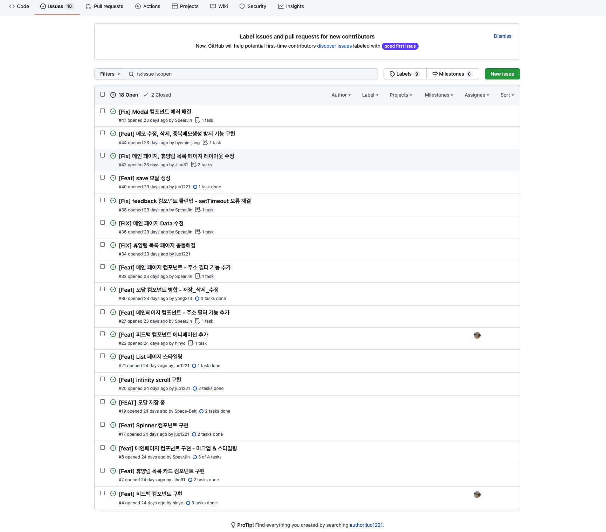
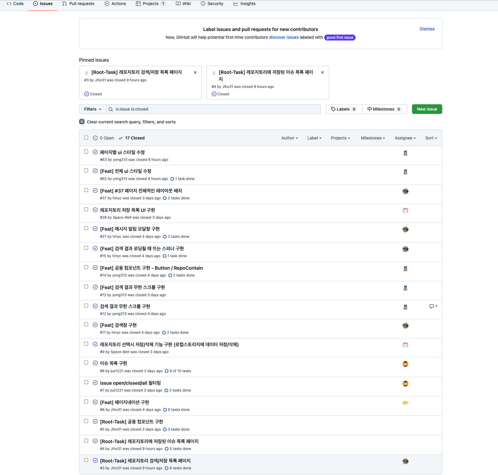
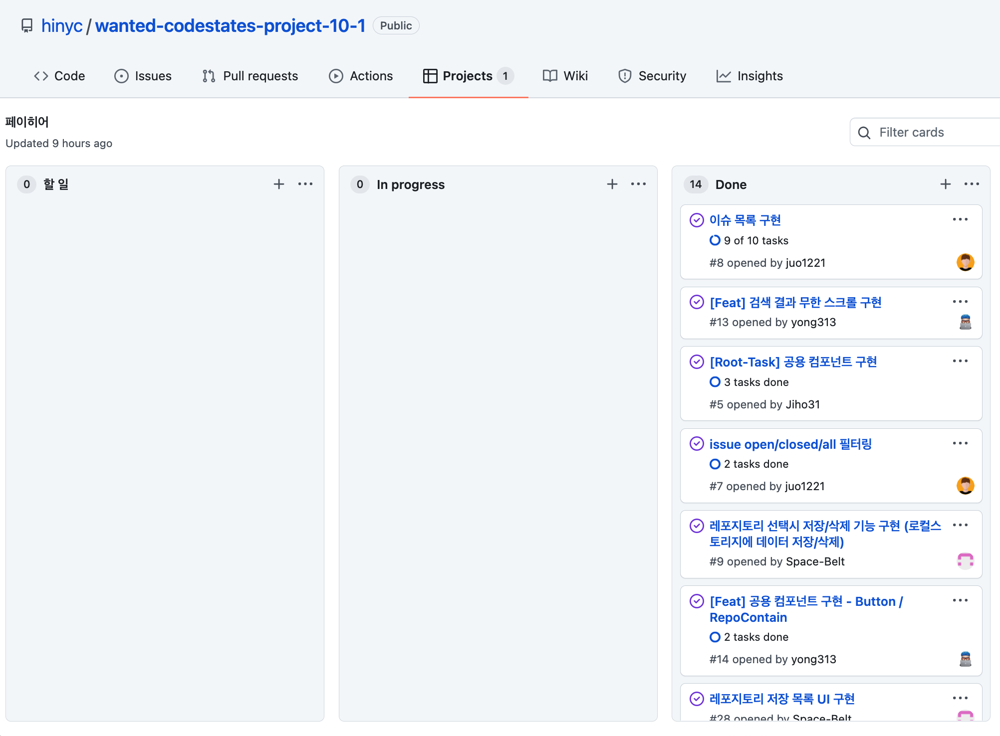
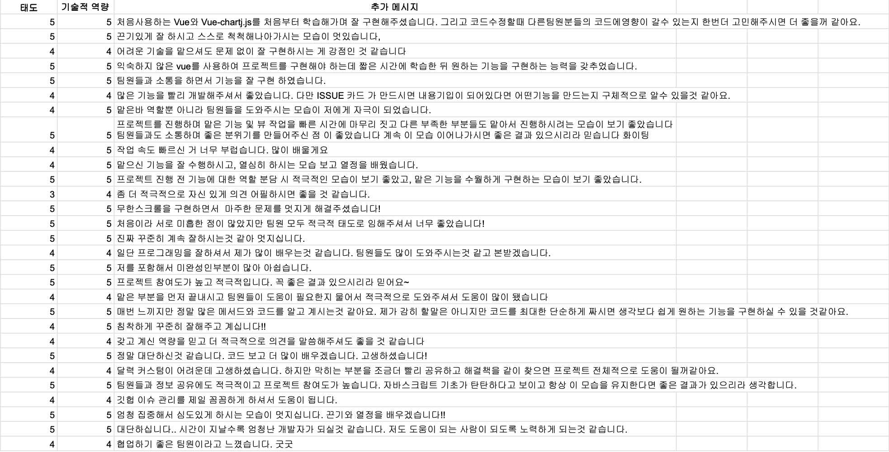

## 진행해온 Project들

  <ul>
    <li>충청북도 휴양림 App</li>
    <li>카트라이더 전적 검색 페이지</li>
    <li>기업과 나의 성향 매칭 App</li>
    <li>돌보미 매칭 App</li>
    <li>설문조사 폼 생성 App</li>
    <li>쇼핑몰 App</li>
    <li>깃허브 repo와 issues 로딩 App</li>
    <li>검색한 상품 매칭 App</li>
  </ul>

# review

### 1. 협업

그동안 대부분의 시간을 혼자서 인강을 보며 공부하거나 개인 프로젝트를 하는데 소비했지 팀 프로젝트는 소홀히 하고 있음을 어느 순간 강하게 느꼈다. 유튜브나 여러 강의를 듣다 보면 항상 듣게 되는 얘기가 있는데 바로 커뮤니케이션의 중요성이다.

개발자들 간 소통 문제는 굉장히 중요하다고 생각한다. 특히 나와 같이 경험 자체가 많이 부족한 초보자들은 익숙지 않은 용어들도 많고 협업 툴에 대한 이해도도 낮을뿐더러 코드도 잘 못 짜기 때문에 커뮤니케이션 능력은 당연히 낮을 수밖에 없다. 개인적으로 소통 능력은 코드에 담긴 상대방의 의도를 얼마나 잘 이해할 수 있는지와 자신의 코드를 얼마나 상세하게 설명해 줄 수 있는가에 달려있다고 생각한다. 이외의 중요한 것들도 많겠지만.
 

아무튼 이런 능력들이 많이 부족하다고 느끼던 와중에 약 한 달 동안 빡세게 팀 프로젝트를 경험할 수 있는 좋은 기회를 얻게 됐다. 지금은 줄었지만 7명에서 시작한 프로젝트의 첫 시작 때 공포감을 좀 느꼈었다. 나를 제외한 모두가 협업 경험을 가졌던 것도 그랬고 첫 시작을 어떻게 해야 하는지 감을 잡지 못해서 혼자 끙끙 앓았던 기억이 난다ㅎㅎ..

다행히 팀원들 계서 친절하고 상세히 알려주셨고 어찌어찌 감을 좀 잡을 수 있게 됐다. 이제부터 내가 헤맸던 기초적인 부분과 그동안 배우고 느꼈던 점을 기록하려고 한다.
### 2. 레포 fork

대부분 비슷하겠지만 우리가 팀 프로젝트를 진행한 방식은 다음과 같다. 팀장이 repo를 만들면 main과 dev 브랜치를 딴다. main 브랜치는 배포 시에만 사용하고 개발할 땐 오직 dev 브랜치만 이용하도록 한다. 팀원은 repo를 fork 한 뒤 로컬에서 dev 브랜치를 만들고 upstream 레포에 올라와 있는 dev 브랜치를 pull 한다. 이후엔 자유롭게 로컬에서 작업하면서 작업 내용을 기능단위로 커밋 한다. 이후 머지 타임이 되면 각자 작업한 커밋 내용을 dev 브랜치로 Push 해서 코드를 합치게 된다.

처음엔 **왜 fork를 해야 하는지 이유를 알지 못했다.** 팀장의 upstream 레포를 바로 클론 해와서 작업하는 것과 어떤 차이가 잘 몰랐다. fork 한 뒤 작업을 하게 되면 얻게 되는 이점은 다음과 같다.

 
<b>최소한의 안전 확보</b>

fork를 하지 않고 작업해도 작업 자체는 무리 없이 진행할 수 있지만 여러 사람이 작업할 때 발생할 수 있는 문제를 사전에 방지할 수 있다. 여기서 발생할 수 있는 문제란 **코드의 병합 시 발생할 수 있는 문제**를 말한다.

내가 커밋하고 푸시 하는 내용이 내 원격 저장소 (origin)에만 먼저 반영되고 upstream에는 반영되지 않기 때문에 로컬에서 자유롭게 코딩을 할 수 있다. 그리고 작업한 내용을 push 했을 경우 원격 저장소의 권한을 가진 사람만이 병합을 진행할 수 있기 때문에 코드가 삭제되거나 꼬여버리는 문제를 방지할 수 있다.

팀 프로젝트를 하기 전 여러 가지 규칙을 먼저 정하게 된다. issue 작성은 어떻게 하고, pr은 어떤 방식으로 날릴지 커밋은 어떻게 작성할지 등을 먼저 정하지만 모든 사람이 이러한 규칙을 철저하게 따르기는 사실 힘들다고 생각한다. 누구나 실수할 수 있고, 더욱이 초보일 경우는 그런 빈도수가 잦을 확률이 높기 때문에 제공되는 안전장치인 fork를 이용하도록 하자.

### 3. 역할 분담

프로젝트를 하면 할수록 역할을 나누는 게 굉장히 중요하다는 것을 많이 느꼈다. 역할이 명확하지 않으면 중첩된 기능 구현을 하게 될 가능성이 상당이 높아진다. 이것은 머지 할 때 충돌로 이루어지기 때문에 코드를 수정해야 하는 추가적인 시간적 비용이 들어간다. 애써 작업한 내용이 머지 후 손실되는 쓰라린 경험을 해봤기 때문에 역할 분담의 중요성을 더욱 느꼈던 것 같다.

### 
*처음 진행했던 프로젝트의 이슈관리*

생성된 issue는 있지만 closed된 이슈는 거의 없다.. Assignee는 누군지 분명하지도 않고 Projects는 있는지도 모른 상태였다.

### 
*최근 진행했던 프로젝트의 이슈관리*
### 
*최근 진행했던 프로젝트의 칸반보드* 

칸반보드 정말 좋았다... 팀원들을 진행 상황을 바로바로 알 수 있는데 이런 기능을 모르고 있었다니 허허 

팀원분들도 비슷한 경험을 겪으셔서 그런지 프로젝트를 진행할수록 이슈관리, 마일스톤, 칸반 보드 이용 등 협업을 도와주는 다양한 툴에 대한 관심이 자연스럽게 높아졌고 결론적으로 처음보다 확실히 개선된 모습을 볼 수 있었다.

### 4. 충돌 해결

우리는 머지 타임을 정해놓고 시간이 되면 다 같이 모여 머지 하는 것을 지켜보는 식으로 프로젝트를 진행했다. 예를 들어 저녁 8시 30분에 머지 한다고 하면 그전까지 최대한 맡은 부분을 구현하다가 시간이 되면 작업이 끝나지 않았더라도 일단 push 하고 코드를 합쳤다. 이때 머지는 팀장님의 화면공유로 모두가 지켜보는 가운데서 이루어졌는데 이때 발생하는 충돌을 해결하는 과정에서 약간의 아쉬움이 남아있다.

일단 충돌이 나면 github 페이지에서 resolve 버튼을 눌러 페이지에서 충돌을 하나하나 해결해나간다. 이때 **발생하는 문제점**들이 있었는데

1. 어디에서 충돌이 났는지 한눈에 알아보기 힘들다.
2. 프리티어와 린트가 적용되지 않기 때문에 괄호나 지워선 안되는 코드 일부를 같이 삭제할 수 있다.
3. resolve를 하면서 바로바로 테스트하지 못한다.

정도가 있었다. 이런 문제는 가끔 모두에게 힘든 시련을 줬는데.. 바로 머지 한 다음 에러가 발생하는 경우다.

머지하기 전 정상작동했던 코드가 충돌을 해결하고 머지한 후엔 작동하지 않는다던가, 혹은 알 수 없는 node modules 에러로 인해 코드를 작성하는 시간보다 머지 후 오류를 잡는데 시간을 투자했던 적도 있었다.

한번쯤은 다른 방법을 이용해도 됐을법했는데 그러지 못했던 것 같아 아쉽다. 기회가 된다면 다음번엔 다른 방식으로도 진행해보고 싶다.

### 5. 팀원

팀원들은 다들 너무 좋았다. 끝까지 남아서 같이 진행했던 팀원은 나를 포함해 5명인데 모두 각자의 강점이 있었다. 모두 책임감 있는 모습을 보여주셨고 정말 다들 짜증 한번 안 내고 적극적으로 도와주셨다. 도움을 주고받는 과정에서 각자의 코딩 스타일을 살짝 엿볼 수 있었고 평소에 이용하는 툴이 있는지, 어떤 라이브러리를 사용하고 특정 기능은 어떤 식으로 구현하는지에 대한 논리적인 사고도 볼 수 있었다.
난 주로 애용하는 툴로 Fig라는 앱을 소개해 드렸는데 다들 너무 좋아하셔서 괜히 뿌듯했던 기억도 난다...ㅋㅋ

팀 프로젝트는 많이 해볼수록 좋다는 말을 들은 적이 있는데 그 이유를 알 수 있었다. 마음이 맞는 팀원들과 서로 얘기하고 응원하면서 혹은 의견을 어필하면서 스스로에 대한 자신감도 키울 수 있었다.

### 6. 아쉬운 점
코드 리뷰가 없었다. 정말 아쉽지만 시간상 어쩔 수 없었다. 우리는 모두 코드 작성에 서툴고 부족함이 많은 초보 개발자이기 때문에 사실 코드 리뷰를 통해 극적인 개선이 이루어질 거라곤 생각하지 않는다.
다만 내 코드를 남에게 설명할 수 있는 시간을 가질 수 있고, 다른 사람은 왜 그렇게 작성했는지 들을 수 있기 때문에 시야를 넓힐 수 있을 거라고 생각한다.

약 한 달의 기간 동안 주어진 과제를 정말 쉴 새 없이 진행해왔지만 그와 관련된 링크는 저작권의 문제로 제공할 수 없다. 같이 진행한 프로젝트는 많은데 써먹을 곳이 한 군데도 없다니 😓

이대로 끝내기엔 조금 섭섭해서 혹시 따로 팀 프로젝트를 한 1~2주 동안 해보실 생각 없냐고 여쭤봤더니 다행히도 모두가 흔쾌히 수락해주셨다ㅎㅎ
코드 리뷰나 협업 관련 개선사항을 다음 팀 프로젝트 때 적용해 보는 걸로 아쉬움을 달랠 수 있었다.

### 7. 나에대한 피드백

### 
*진심이 담긴 팀원들의 피드백* 

아마 진심이 맞을거다. 다들 좋으신 분들이니까 음..

### 8. 결론
은 정말 좋은 경험이었다. 내가 생각하는 나의 가장 큰 문제점을 해결하기 위해 지원했고 완벽하진 않지만 어느 정도 해소해냈다. 완벽하게 해소하지 못한 이유는 다음과 같다.
1. 아직 git과 github 기능의 절반의 반도 사용하지 못하고 있다는 것을 깨달았다. 관련 강의 몇 번 보고 혼자 프로젝트 할 때 써먹었던 지식은 정말 빙산의 일각이란 사실을 뼈저리게 느꼈다.
2. 너무 단기간으로 여러 개의 프로젝트를 진행해서 급했다. 양이 많으면 질이 떨어지는 거랑 비슷하다고 생각한다. 앞으로는 좀 더 여유를 두고 코드 품질까지 생각해가며 프로젝트를 진행하고 싶다.

얻은 게 훨씬 많기 때문에 결론은 긍정적이다. 껄껄
