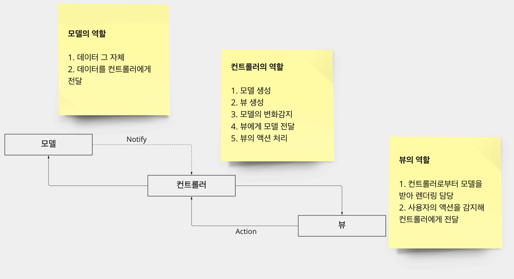
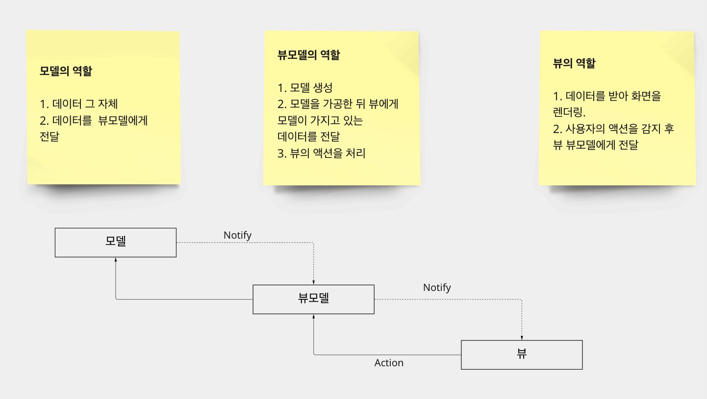
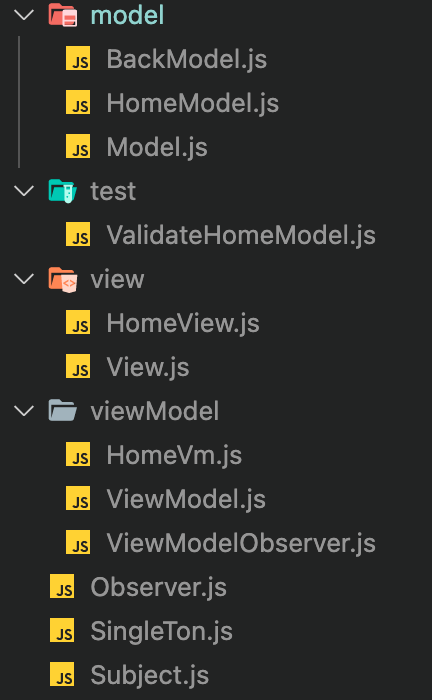

## MVVM 이란?

model, view, viewModel을 말한다.
mvvm은 mvc로부터 파생된 하나의 패턴이기 때문에 mvc를 이해하지 못하면 mvvm도 이해하기 힘들다. 

### MVC와 제왕적 controller?
### 

위와 같이 MVC에서는 컨트롤러가 많은 역할을 담당하고 있음을 볼 수 있다. MVC에서 화면이 갱신되는 흐름을 살펴보면 다음과 같다. 

1. 먼저 뷰의 액션을 감지하면 컨트롤러가 모델을 불러 액션에 맞게 처리하도록 명령한다. 
2. 모델은 스스로 자신의 상태를 바꾸고 컨트롤러에게 자신의 상태가 변경됐다고 notify 한다.
3. 컨트롤러는 모델의 옵저버이기 때문에 변화가 일어난 모델을 알게 된다.
4. 변화가 발생한 모델 자체를 뷰에게 전달한다. 
5. 뷰는 모델을 가지고 다시 렌더링 해서 화면을 갱신한다. 

MVC의 가장 큰 특징은 간단한 프로젝트에서 굉장히 막강하다는 점이다. 간단한 프로젝트란 갱신해야 할 뷰가 얼마 없음을 말하는데, 렌더링 해야 될 view가 많아질수록 MVC의 단점이 부각된다.

기본적으로 뷰는 모델 자체를 이용해서 화면을 렌더링 하게 된다. 즉 뷰는 모델의 변화에 민감하기 때문에 기존에 뷰가 알고 있던 모델의 정보와 다른 식으로 모델이 변한다면 모든 뷰가 깨져버리는 일이 발생할 수 있다.

예를들어,
```
// view
<ul>
    <li>
        <h1>model.title</h1>
        <p>model.contents</p>
    </li>
</ul>
```
이런 식으로 모델의 정보를 받아 화면을 그리고 있었는데 어느 날 갑자기 모델의 title이 titl라고 변경된다면 어떻게 될까?
```
// view
<ul>
    <li>
        <h1>model.title</h1> // model의 title은 더 이상 없는 정보
        <p>model.contents</p>
    </li>
</ul>
```
따라서 뷰는 모델의 제목을 정상적으로 출력할 수 없게 된다. 만약 이런 뷰가 1개가 아니라 몇 백 개가 된다면 변화가 발생한 모든 뷰를 찾아 수정하거나 모든 뷰를 갱신해야 한다.


### 그렇다면 MVVM은 이런 문제를 어떻게 최소화할까?

### 

먼저 MVVM에서는 구독 관계가 하나 더 생기게 된다. 

**뷰 : 구독자**

**뷰 모델 : 뷰의 알림이 이자 모델의 구독자**

**모델 : 뷰 모델의 알림이**
<br/>
<br/>
MVVM에서 화면이 갱신되는 흐름을 살펴보면 다음과 같다. 


1. 먼저 뷰의 액션을 감지하면 뷰 모델이 가지고 있는 모델을 불러 액션에 맞게 처리하도록 명령한다. 
2. 모델은 스스로 자신의 상태를 바꾸고 뷰모델에게 자신의 상태가 변경됐다고 notify한다.
3. 뷰 모델은 모델의 옵저버이기 때문에 변화가 일어난 모델을 알게 된다.
4. 모델이 가지고 있는 **데이터를 가공**한다.
5. 뷰에게 데이터를 전달한다.

뷰 모델은 뷰에 대해 알고 있는 정보가 없다. 뷰 모델이 데이터를 가공하면 단지 뷰가 가져다가 사용하면 된다. 이런 관계는 유튜버와 시청자로 비유할 수 있는데, 

**시청자 : view**

**편집 전 영상 : model**

**유튜버 : viewModel**
<br/>
<br/>
사람들은 자신이 선호하는 유튜버만 골라서 구독하면 원하는 영상을 볼 수 있다. 그뿐만 아니라 사람들은 여러 명의 유튜버를 동시에 구독하는 것도 가능해진다. 유튜버는 구독자에 대한 정보를 알 수 없고 원본 영상을 자기 마음대로 편집하면 된다. 그러면 그냥 구독한 구독자에게 자신이 편집한 영상이 보일 뿐이다.
<br/>
<br/>
원본 영상이 손상됐다고 하더라도 유튜버는 손상 부분만 처리해서 영상을 올리면 된다. 시청자는 가공된 정보만 얻기 때문에 원본 영상의 손실로 인해 얻는 피해는 없다. 해당 영상이 마음에 들지 않으면 구독을 취소해버리면 그만이다.

MVVM의 장점이 바로 여기서 나타난다. viewModel은 view를 모르기 때문에 모델이 변하면 뷰를 고쳐야 하는 피해를 방지할 수 있는데, 변화가 발생한 모델의 경우 **viewModel에서 테스트를 통해** 감지할 수 있기 때문이다. 기존과 다른 모델의 데이터가 있다면 viewModel에서 자체적으로 데이터를 가공하면 되기 때문에 MVC의 문제를 해결할 수 있다. 

## 고양이 사진첩 MVVM 적용하기

 항상 투두리스트만 만들기는 지겨웠는데 프로그래머스의 과제관에 보면 고양이 사진첩 만들기라는 괜찮은 테스트 프로젝트를 발견했다. 해당 프로젝트를 MVVM을 적용해 만들어보고 핵심이 되는 코드만 살펴보자.

### File Tree
### 

흐름 (복잡한 관계는 최대한 생략)

- HomeView => HomeVm을 구독
- HomeVm => HomeModel과 BackModel을 구독

1. HomeView에서 사용자 액션 발생
    ```
        util.sel('.Nodes').addEventListener('click', (e) => viewModel.$direct(e.target.dataset.id));

    ```
2. HomeVm에서 액션 처리 후 homeModel의 notify 호출
    
    ```
    async $direct(id) {
        await homeModel.load(id);
    }
    homeModel.notify();
    ```
    homeModel에서 load 하면 서버 데이터를 fetch 해오고 그 결과를 저장.

3. HomeVm에서 notify한 모델(homeModel)을 수신하고 테스트 (ValidateHomeModel)
    ```
    listen(model) {
            const { datas } = new ValidateHomeModel(model);
        }
    }
    ```
4. ValidateHomeModel에서 테스트 과정
    ```
    const ValidateHomeModel = class {
    #private;
    constructor(homeModel) {
        if (!util.is(homeModel, HomeModel)) util.err(`invalid homeModel : ${homeModel}`);
        const { list, path } = homeModel;
        if (!Array.isArray(list) || !list.length) util.err(`invalid list : ${list}`);
        list.forEach((li) => {
        const { id, name, type, filePath, parent } = li;

        ...타입 체크 등등 필요한 테스트를 실행하는 부분

        this.#private = { list, path }; // 테스트가 성공적으로 마치면 저장 
    }
    get datas() {
        return this.#private; // 저장한 값 보내기
    }
    };
    ```
5. HomeVm은 테스트가 끝난 데이터를 자신을 구독하고 있는 view에게 notify
    ```
    listen(model) {
            const { datas } = new ValidateHomeModel(model);
            this.notify(datas.list, datas.path);
        }
    }
    ```
6. 구독자인 HomeView는 해당 데이터를 수신
    ```
    const HomeView = class extends View {
        
        render(arr, pathArr) {
            ... 전달 받은 arr, pathArr를 가지고 렌더링 로직 작성 부분
        }
    };
    ```
위의 과정이 끝나면 렌더링된 화면으로 갱신되게 된다.

코드 : https://github1s.com/juo1221/catPhotos-mvvm

깃헙 주소 : https://github.com/juo1221/catPhotos-mvvm


참고 : 코드스피츠 강의, 프로그래머스 과제관

